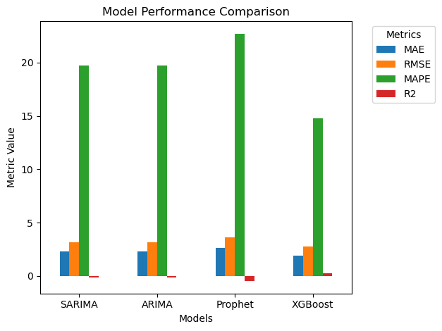
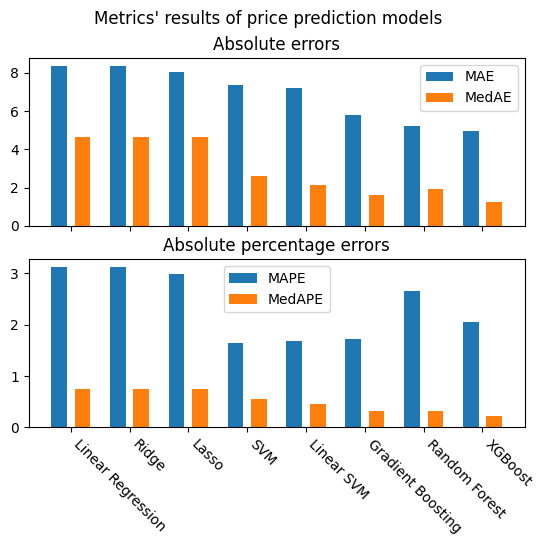

# DataScience-RealEstateTrendAnalysis


## Table of Contents

- [Overview](#overview)
- [Dataset](#dataset)
- [Requirements](#requirements)
- [Installation](#installation)
- [Usage](#usage)
  - [Data Scraping](#data-scraping)
  - [Data Cleaning](#data-cleaning)
  - [EDA](#eda)
  - [Machine Learning Models](#machine-learning-models)
  - [LLM for Regression](#llm-for-regression)
- [Evaluation Metrics](#evaluation-metrics)
- [Results](#results)
- [Analysis](#analysis)
- [Acknowledgments](#acknowledgments)

---

## Overview

The real estate market plays a crucial role in economic stability, with housing affordability, price volatility, and market recovery being key challenges. 
This project aims to use data science techniques, such as machine learning and time-series analysis, to predict housing market trends, identify the factors driving affordability issues, and forecast price fluctuations and recovery cycles. The insights gained will inform policy decisions and investment strategies.

---

## Dataset
The dataset for this project consists of housing price data collected from two websites: rever.com and cafeland.vn. The data contains information about real estate listings, including prices, location, property type, area, and other relevant features. This dataset is used for building machine learning models to predict property prices and classify property types.

The dataset for this project includes the following columns:

- **Price (billion VND)**:
   - The price of the property in billion Vietnamese Dong (VND).

- **Area (m2)**:
   - The area of the property in square meters (m²).

- **Property Type**:
   - The type of the property (e.g., house, apartment, land, villa, etc.).

- **Bedrooms**:
   - The number of bedrooms in the property.

- **Bathrooms**:
   - The number of bathrooms in the property.

- **Address**:
   - The detailed address of the property.

- **Law Document**:
   - The legal status of the property, such as ownership documents or other legal papers.

- **Post Date**:
   - The date the property was listed for sale or rent.

- **Latitude**:
    - The latitude of the property, used to determine its geographical location on a map.

- **Longitude**:
    - The longitude of the property.

- **Postal Code**:
    - The postal code for the area where the property is located.

- **Importance**:
    - The importance or priority of the property collected from GeoCoding API

- **Place Rank**:
    - The ranking of the property collected from GeoCoding API

- **City**:
    - The city or region where the property is located.

You can find the processed dataset in the `combinedData.csv` file

---

## Requirements

The following libraries and frameworks are required for running the project:

- Python 3.10
- NumPy
- Pandas
- Matplotlib
- Scikit-learn
- XGBoost

...

To install these dependencies, you can use the provided `requirements.txt` file.

### Example:

```
pip install -r requirements.txt
```

---

## Installation

1. **Clone the repository:**

   ```
   git clone https://github.com/Thanh-2004/DataScience-RealEstateTrendAnalysis.git
   cd DataScience-RealEstateTrendAnalysis
   ```

2. **Install dependencies:**

   ```
   pip install -r requirements.txt
   ```

   Alternatively, install required libraries individually using `pip`.
   

---

## Usage

### Data Scraping

In this project, we utilized **Scrapy** to crawl property listing data from two websites: **cafeland.vn** (Hanoi) and **rever.com** (Ho Chi Minh City). The scraped data focuses on property listings, including key features such as price, area, location, property type, and more.

The process involves scraping real estate data using custom Scrapy spiders:

1. **Data Sources**:
   - **cafeland.vn**: This website provides real estate data for Hanoi.
   - **rever.com**: This website offers property listings for Ho Chi Minh City.

2. **Spiders Overview**:
   The `DataScraping` folder contains the following spiders:
   - `RealEstate` (for **cafeland.vn**)
   - `Reverspider` (for **rever.com**)
   - `TownHouseReverspider` (for **rever.com**, focused on townhouses)
  
To run Scrapy spiders, run these following commands:

- Navigate to the directory that contains the desired spider:
 Use the `cd` command to move to the folder containing the spider script. For example:

```
cd rever.com_spider
```

- Start crawling: 
```
scrapy crawl <spider_name> -o <file_name>
```
- Replace <spider_name> with one of the following:
  - `RealEstate`
  - `Reverspider`
  - `TownHouseReverspider`
- Replace <file_name> with the desired output file name. The output file can be in .json or .csv format.


### Data Cleaning
Data crawled from [rever.com](https://rever.vn/) is complete and clean. Therefore, our efforts is spent in cleaning data from [CafeLand.com](https://cafeland.vn/).
#### Data Preprocessing
- **Data Extraction**: Raw data is extracted and formatted for proper usage from `.json` files generated from our spider. The details can be found in `DataCleaning/ExtractingFeatures.py`.

- **Data Preprocessing**: `DataCleaning/CleanData.py`
  - One of our main purposes is to predict real estate price based on common characteristics that properties share. To serve this, all data with missing value in **Price (billion VND)** is dropped.
  - We also drop features with the NaN percentage crossing a certain threshold **(60% in this case)**.
  - Since real estate from [CafeLand.com](https://cafeland.vn/) should be those in Hanoi, all houses not in Hanoi are excluded as well.
  - **Address**, **Latitude**, and **Longitude** are used to impute each other with the help from [free GeoCoding API](https://geocode.maps.co/).
  
- **Data Imputation**: `DataCleaning/Imputer.py`
  - **Multivariate Imputation by Chained Equations (MICE)**: Apply for features satisfying the additive assumption in regression.
  - **Predictive Mean Matching (PMM)**: Apply for features where high correlation (multi-collinearity) exists.
  
- **Addition of related data**: `DataCleaning/AdditionalInfo.py`
Making use of the properties' coordinates and `geopy.Nominatim`, the following fields are added:
  - **Place Rank**: Describe the extend and importance of a place
  - **Importance**: How likely it is that an user will search for a given place.
  - **Postal Code**
  
To run the cleaning process, remember to get your GeoCoding API from [free GeoCoding API](https://geocode.maps.co/):
```
python3 main-clean.py
```
or
```
python main-clean.py
```

After cleaning, data from [rever.com](https://rever.vn/) and [CafeLand.com](https://cafeland.vn/) is stacked. Outliers are removed using the Interquatile Range (`DataCleaning/Outliers.py`)

### EDA

The notebook for EDA section can be found in the `EDA` folder.

### Machine Learning Models

You can find notebooks used to train the ML models in `MachineLearningModels/notebooks`. Each notebook is used to train models using a ML algorithm for the two problems: estate price prediction and property type classification.

To run the demonstration on price prediction, run:
```
python3 PricePredictionDemo.py
```
or
```
python PricePredictionDemo.py
```

This will run a window to select a random record from the testing dataset and display it, along with the predicted price by a model trained on the training dataset and the actual price of the estate for comparison.

### LLM for Regression

We also explored how LLMs can perform regression tasks solely based on prompting. This is a side experiment that has not been fully documented yet. If you find it interesting, you can refer to the `LLM.ipynb` notebook for more details.

---

## Evaluation Metrics

For ML models, the following metrics are used to evaluate how well the models perform:

- For the price prediction problem: Root Mean Squared Error (RMSE), Mean and Median Absolute Error (MAE & MedAE), Mean and Median Absolute Percentage Error (MAPE & MedAPE)
- For the property type classification problem: Accuracy, Precision, Recall, F1 score

---

## Results

### The performance on Time-Series Forecasting:



### The performance on Real Estates Price Regression:



### The performance on Real Estates Price Regression with LLM:

| **K (number of sample)** | **MAE** | **RMSE** | **MedAE** | **MAPE (%)** | **MedAPE (%)** | **Time (m:ss)** |
| --- | --- | --- | --- | --- | --- | --- |
| 401 | 4.21 | 5.89 | 2.35 | 54.46 | 53.13 | 2:53 |
| 301 | 4.30 | 6.30 | 2.17 | 160.55 | 88.21 | 1:50 |
| 201 | 5.03 | 10.44 | 2.08 | 211.31 | 58.91 | 1:06 |
| 101 | 9.77 | 12.60 | 9.52 | 191.94 | 73.26 | 1:00 |
| 51  | 10.34 | 14.16 | 7.60 | 124.38 | 77.63 | 1:03 |
| 21  | 14.07 | 17.80 | 12.78 | 212.48 | 93.40 | 0:58 |

### The performance on Real Estates Type Classification:

| Model            | Accuracy (%) | Precision | Recall | F1 Score |
|-------------------|-------------|-----------|--------|----------|
| Linear SVM        | 57.86       | 0.483     | 0.426  | 0.421    |
| Random Forest     | 81.70       | 0.793     | 0.787  | 0.790    |
| Gradient Boosting | 81.99       | 0.753     | 0.737  | 0.744    |
| XGBoost           | 83.64       | 0.780     | 0.778  | 0.779    |

- **XGBoost** achieved the highest accuracy (83.64%) and balanced performance across all metrics (Precision, Recall, F1 Score).
- **Random Forest** and **Gradient Boosting** showed comparable results, with high accuracy and F1 scores.
- **Linear SVM** had the lowest performance across all metrics, suggesting that it might not be the best-suited model for this dataset.

These results highlight the effectiveness of ensemble learning methods, particularly **XGBoost**, for this problem.

---

## Analysis

The analysis of pairwise relationships reveals several important trends. Property size, represented by area, as well as the number of bedrooms and bathrooms, are the most consistent drivers of price. These features show strong positive relationships with property value, underscoring their importance in predictive modeling. Location-related features, such as place rank, further emphasize the importance of qualitative factors in real estate pricing, though their direct correlation is less pronounced.

Additionally, the presence of high-value outliers across all features points to unique market segments, including luxury and commercial properties, that deviate from the broader market trends. These insights provide a comprehensive understanding of the factors influencing property prices, serving as a foundation for the development of robust predictive models.

The result of machine learning models shows that they can assist buyers, sellers, and investors in making informed decisions. The classification model can aid in categorizing property types for better organization and targeted marketing by real estate platforms.

---

## Acknowledgments

---
